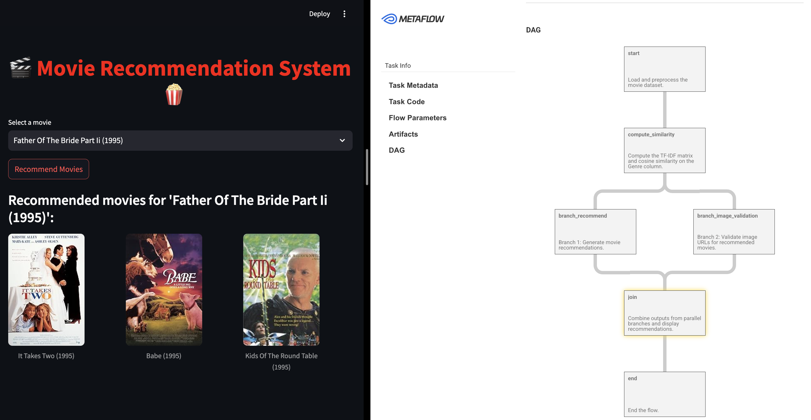

# 🎬 Movie Recommendation System 🍿

This project is a **Movie Recommendation System** that leverages **Metaflow** to provide personalized movie recommendations based on genre similarity.

---

## Overview

The project uses Metaflow to:

✅ Load and preprocess a movie dataset.  
✅ Compute **TF-IDF** and **Cosine Similarity** for genre-based recommendations.  
✅ Generate movie recommendations and validate poster URLs.  
✅ Display results using **Metaflow Cards** and **Streamlit**.

### Visual Workflow (DAG)
Below is the DAG representation of the Metaflow pipeline:



---

## Features

1. **Streamlit Frontend:**  
   - Interactive UI for users to select movies and view recommendations.
   - Displays movie posters with titles.

2. **Metaflow Pipeline:**  
   - DAG Workflow includes steps like:
     - **`start:`** Load dataset.
     - **`compute_similarity:`** Compute TF-IDF similarity.
     - **`branch_recommend:`** Generate movie recommendations.
     - **`branch_image_validation:`** Validate poster URLs.
     - **`join:`** Combine recommendations for final output.

3. **Parallel Branching:**  
   - Ensures recommendation generation and image validation run in parallel for improved performance.

---

## Installation

1. Clone the repository:
```bash
git clone <repo_link>
```

2. Install dependencies:
```bash
python3 -m venv your_env
source your_env/bin/activate
pip install -r requirements.txt
```
3. Run Streamlit App
```bash
streamlit run 6_streamlit_netflix.py
```

4. Run Metaflow Pipeline For parallel branch execution

Run the Flow:
```bash
python 8_stramlt_mtflw_parallel_branch.py run --movie_title "Inception"
```
List the Flow Runs (to identify the correct run ID):
```bash
python 8_stramlt_mtflw_parallel_branch.py show
```
View the Card (Use the correct run ID):
```bash
python 8_stramlt_mtflw_parallel_branch.py card view join
```  


<!-- # Dataset
# The project uses a subset of the MovieGenre.csv dataset containing:
# - Title (Movie Title)
# - Genre (Movie Genres)
# - Poster (Poster URLs)

# Sample Output
# ✅ Example Recommendations for "Father of the Bride Part II (1995)":
# - It Takes Two (1995)
# - Babe (1995)
# - Kids of The Round Table (1995)

# Contributing
# Feel free to open an issue or submit a pull request if you have suggestions or improvements!

# License
# This project is licensed under the MIT License. -->

